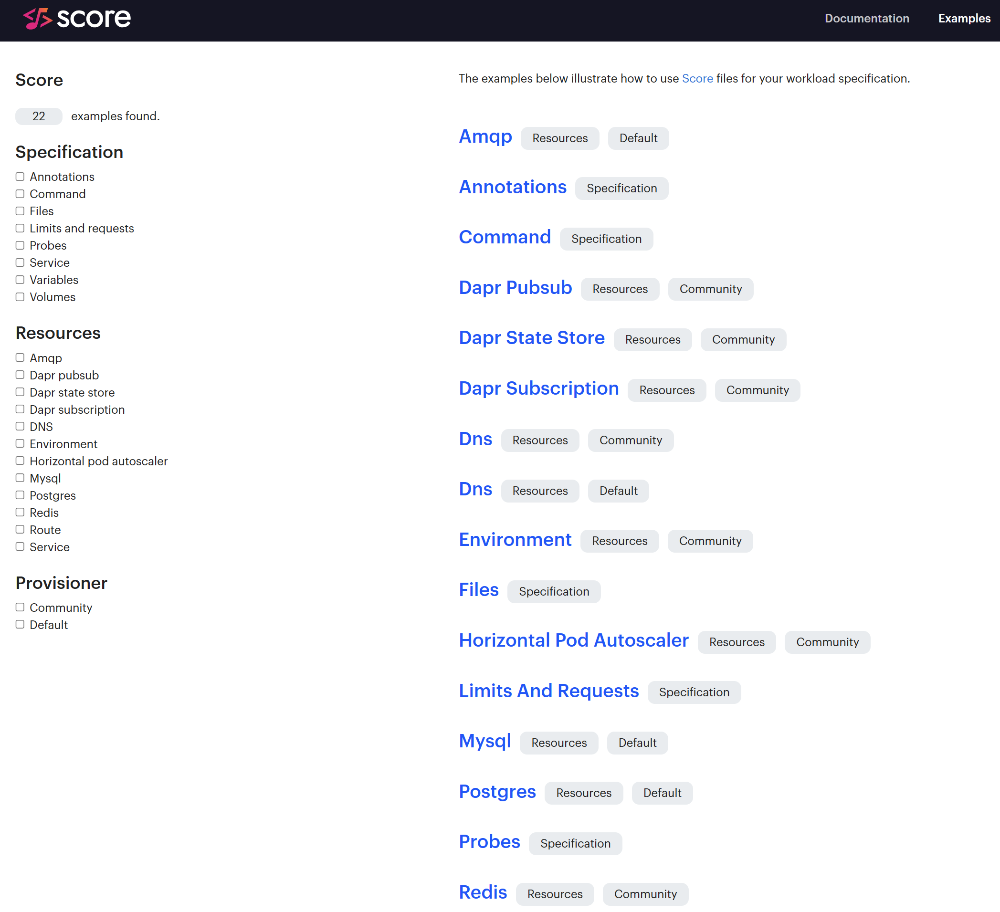

🎉 Today, Score celebrates its first anniversary as [CNCF Sandbox](https://score.dev/blog/score-joins-the-cncf-as-a-sandbox-project/), time flies! 🎉

Wow! What a ride, nothing but fun, gratitude and great learnings! 

One of our key learning is that an open source project without its contributors and its community cannot go that far.

We are very grateful for all the interactions and contributions with and by the Score community, solidifying the Score's mission:

> Score is loved by developers because they can run the same workload on completely different technology stacks, without needing to be an expert in any one of them.

In one year, the Score project got [19 new contributors](https://score.devstats.cncf.io/d/52/new-contributors-table?orgId=1&from=1720324800000&to=1751947199000)!

[Humanitec](https://humanitec.com/) has played an important role for the Score project, since its creation, through the donation to the CNCF and by still making sure the Score project is growing outside Humanitec employees and customers. We now have 50% of the Maintainers outside of Humanitec and the number of Contributors is now at 90% outside Humanitec. This is key to set a sustainable foundation for the Score project and its community to grow and expand.

The [Cloud Native Computing Foundation (CNCF)](https://www.cncf.io/) has been instrumental to onboard [Score as a CNCF project](https://www.cncf.io/projects/score/), by providing a framework, the tools and the guidance to grow as a community. Last [KubeCon EU 2025 in London](https://score.dev/blog/kubecon-london-2025-trip-report/) was a great example, where the Score project got the opportunity to have a Project Lightning talk, a ContribFest and a Kiosk.

Great collaborations with other CNCF projects have been very inspirational and part of the highlights of this year, just to name a few of them:
- [Dapr](https://score.dev/blog/kubecon-london-2025-trip-report/)
- [Backstage](https://itnext.io/deploy-backstage-with-score-45bb2d7c2d90)
- [Microcks](https://github.com/score-spec/community-provisioners/issues/22)
- [Podman](https://github.com/score-spec/sample-score-app/pull/51)
- _And more to come!_

Today, to illustrate and celebrate Score's first anniversary as CNCF Sandbox, we want to have a dedicated Contributors spotlight section to highlight 4 major features delivered during the last few months.

_Note: We cannot highlight each contribution individually, but again we are very grateful to all the contributors and community members: your time, expertise and feedback are really much appreciated and inspiring!_

# 🎉 `score-compose|k8s init --provisioners`

Kudos to [**Rashid Alam**](https://www.linkedin.com/in/rash-alam/)! Thanks to his contributions to [`score-go`](https://github.com/score-spec/score-go/pulls?q=is%3Apr+author%3A7h3-3mp7y-m4n+is%3Aclosed), [`score-compose`](https://github.com/score-spec/score-compose/pulls?q=is%3Apr+author%3A7h3-3mp7y-m4n+is%3Aclosed) and [`score-k8s`](https://github.com/score-spec/score-k8s/pulls?q=is:pr+author:7h3-3mp7y-m4n+is:closed), Score's end users can now import custom resources provisioners as OCI image, like illustrated below:


$ score-compose init --provisioners oci://ghcr.io/score-spec/score-compose-community-provisioners:latest#10-redis-dapr-state-store.provisioners.yaml

$ score-k8s init --provisioners oci://ghcr.io/score-spec/score-k8s-community-provisioners:latest#10-redis-dapr-state-store.provisioners.yaml


Yet another collaboration with a CNCF project as this feature is using [ORAS](https://oras.land/adopters)!

Also, thanks to [**Rabel Mervin**](https://www.linkedin.com/in/rabelmervin-571764274/) and his contributions to [`score-go`](https://github.com/score-spec/score-go/pulls?q=is%3Apr+is%3Aclosed+author%3Arabelmervin) and [`score-compose`](https://github.com/score-spec/score-compose/pulls?q=is%3Apr+is%3Aclosed+author%3Arabelmervin), end users can now use local provisioners files or defined inline, like illustrated below:


$ score-compose init --provisioners=- <<"EOF"
- uri: template://env
  type: environment
  outputs: |
    ENV: "development"
    DEBUG: true
EOF


In addition to this, kudos to [**Rashid Alam**](https://www.linkedin.com/in/rash-alam/) and [**Matthieu Evrin**](https://www.linkedin.com/in/matthieu-evrin/) who respectively implemented in [`score-compose`](https://github.com/score-spec/score-compose/pull/293) and [`score-k8s`](https://github.com/score-spec/score-k8s/pull/150) the new flag to skip the import of the default provisioners:


$ score-compose init --no-default-provisioners

$ score-k8s init --no-default-provisioners


_Learn more about the resources provisioners in [`score-compose`](https://docs.score.dev/docs/score-implementation/score-compose/resources-provisioners/) and [`score-k8s`](https://docs.score.dev/docs/score-implementation/score-k8s/resources-provisioners/)._

# 🎉 `score-compose|k8s resources|provisioners list`

Kudos to [**Matthieu Evrin**](https://www.linkedin.com/in/matthieu-evrin/) and his contributions to [`score-go`](https://github.com/score-spec/score-go/pulls?q=is%3Apr+is%3Aclosed+author%3Alekaf974), [`score-compose`](https://github.com/score-spec/score-compose/pulls?q=is%3Apr+author%3Alekaf974+is%3Aclosed) and [`score-k8s`](https://github.com/score-spec/score-k8s/pulls?q=is%3Apr+author%3Alekaf974+is%3Aclosed). The user experience has been boosted and made more consistent around the following `resources` and `provisioners` subcommands:

_As Developer, I can get more details about the resources provisioners made available to me:_


$ score-compose init
$ score-compose provisioners list

$ score-k8s init
$ score-k8s provisioners list

+---------------+-------+------------------+---------------------------------------------------------+---------------------------------------------------------------------+
|       TYPE    | CLASS |      PARAMS      |                                        OUTPUTS          |                                       DESCRIPTION                   |
+---------------+-------+------------------+---------------------------------------------------------+---------------------------------------------------------------------+
| amqp          | (any) |                  | host, password, port, username, vhost                   | Provisions a dedicated RabbitMQ vhost on a shared instance.         |
+---------------+-------+------------------+---------------------------------------------------------+---------------------------------------------------------------------+
| dns           | (any) |                  | host                                                    | Outputs a *.localhost domain as the hostname.                       |
+---------------+-------+------------------+---------------------------------------------------------+---------------------------------------------------------------------+
| elasticsearch | (any) |                  | host, password, port, username                          | Provisions a dedicated Elastic Search instance.                     |
+---------------+-------+------------------+---------------------------------------------------------+---------------------------------------------------------------------+
| kafka-topic   | (any) |                  | host, name, num_partitions, port                        | Provisions a dedicated Kafka topic on a shared Kafka broker.        |
+---------------+-------+------------------+---------------------------------------------------------+---------------------------------------------------------------------+
| mongodb       | (any) |                  | connection, host, password, port, username              | Provisions a dedicated MongoDB database.                            |
+---------------+-------+------------------+---------------------------------------------------------+---------------------------------------------------------------------+
| mssql         | (any) |                  | connection, database, password, port, server, username  | Provisions a dedicated database on a shared MS SQL server instance. |
+---------------+-------+------------------+---------------------------------------------------------+---------------------------------------------------------------------+
| mysql         | (any) |                  | database, host, name, password, port, username          | Provisions a dedicated MySQL database on a shared instance.         |
+---------------+-------+------------------+---------------------------------------------------------+---------------------------------------------------------------------+
...


Given this [Score file](https://github.com/score-spec/sample-score-app/blob/main/score.yaml):


apiVersion: score.dev/v1b1
metadata:
  name: hello-world
  annotations:
    tags: "nodejs,http,website,javascript"
containers:
  hello-world:
    image: .
    variables:
      PORT: "3000"
      MESSAGE: "Hello, World!"
      DB_DATABASE: ${resources.db.name}
      DB_USER: ${resources.db.username}
      DB_PASSWORD: ${resources.db.password}
      DB_HOST: ${resources.db.host}
      DB_PORT: ${resources.db.port}
resources:
  db:
    type: postgres
  dns:
    type: dns
  route:
    type: route
    params:
      host: ${resources.dns.host}
      path: /
      port: 8080
service:
  ports:
    www:
      port: 8080
      targetPort: 3000


_As Developer, I can get more details about the resources that will actually be provisioned:_


$ score-compose generate score.yaml --image ghcr.io/score-spec/sample-score-app:latest
$ score-compose resources list

$ score-k8s generate score.yaml --image ghcr.io/score-spec/sample-score-app:latest
$ score-k8s resources list

+---------------------------------+------------------------------------------------+
|               UID               |                    OUTPUTS                     |
+---------------------------------+------------------------------------------------+
| dns.default#hello-world.dns     | host                                           |
+---------------------------------+------------------------------------------------+
| postgres.default#hello-world.db | database, host, name, password, port, username |
+---------------------------------+------------------------------------------------+
| route.default#hello-world.route |                                                |
+---------------------------------+------------------------------------------------+


# 🎉 `score-k8s generate --namespace`

[**Artem Lajko**](https://www.linkedin.com/in/lajko/), while testing, learning and [blogging about Score](https://medium.com/itnext/stop-building-platforms-nobody-uses-pick-the-right-kubernetes-abstraction-with-gitops-64681357690f), provided a great feedback that landed to a feature request in `score-k8s`: ["How to easily supply the `Namespace` to the generated Kubernetes manifests?"](https://github.com/score-spec/score-k8s/issues/172). Kudos to [**Anurag Yadav**](https://www.linkedin.com/in/yadavanurag13/) who implemented this new feature and associated new flags like illustrated below:


$ score-k8s generate --namespace test --generate-namespace


This is unlocking different and important use cases with `score-k8s`, its [provisioners](https://docs.score.dev/docs/score-implementation/score-k8s/resources-provisioners/) and [patch templates](https://docs.score.dev/docs/score-implementation/score-k8s/patch-templates/). Thank you, Artem and Anurag!

# 🎉 Score Examples Hub

One of the feedback we have been capturing is to show concrete examples and use cases in the Score docs. That's now the case!

Huge kudos to [**Tobias Babin**](https://www.linkedin.com/in/tobiasbabin/) and [**Santiago Beroch**](https://www.linkedin.com/in/santiagoberoch/) for designing and implementing this very powerful [Score Examples Hub](https://docs.score.dev/examples/)!

We have already [plenty of additional ideas and contents to inject in there](https://github.com/score-spec/docs/issues), stay tuned!

# Upwards

On behalf of the Score Maintainers ([**Susa**](https://www.linkedin.com/in/susatuenker/), [**Ben**](https://www.linkedin.com/in/ben-meier-b76224129/), [**Chris**](https://www.linkedin.com/in/chris-stephenson-99ba3628/) and [**Mathieu**](https://www.linkedin.com/in/mathieubenoitqc/)) and the entire Score community, we would like to give a big shout out to all these contributors. You have had so much impact to the Score project!

This is really shaping the future of how Developers and Platform Engineers interact with cloud native applications and tools, reducing the cognitive load on the Developers while enforcing standardization by the Platform Engineers.

Can't wait to see where this community will bring the Score project for its second year as CNCF Sandbox!

- [Join the #score channel in the CNCF Slack](https://cloud-native.slack.com/archives/C07DN0D1UCW)
- [Get started with Score](https://docs.score.dev/docs/get-started/)
- [Contribute to Score](https://clotributor.dev/search?foundation=cncf&project=score)

See you in Atlanta for [KubeCon NA 2025](https://events.linuxfoundation.org/kubecon-cloudnativecon-north-america/)!?
