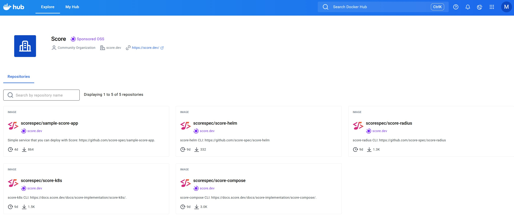
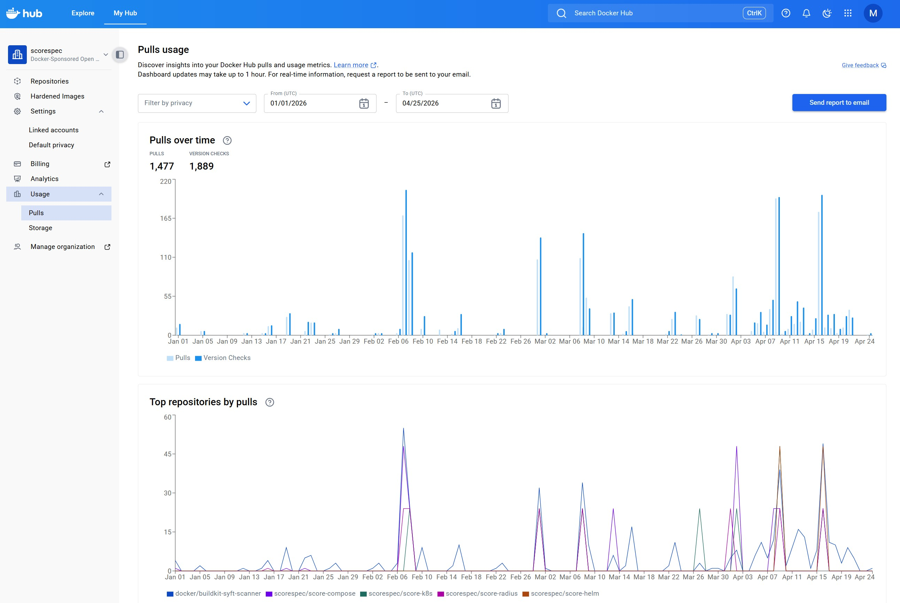
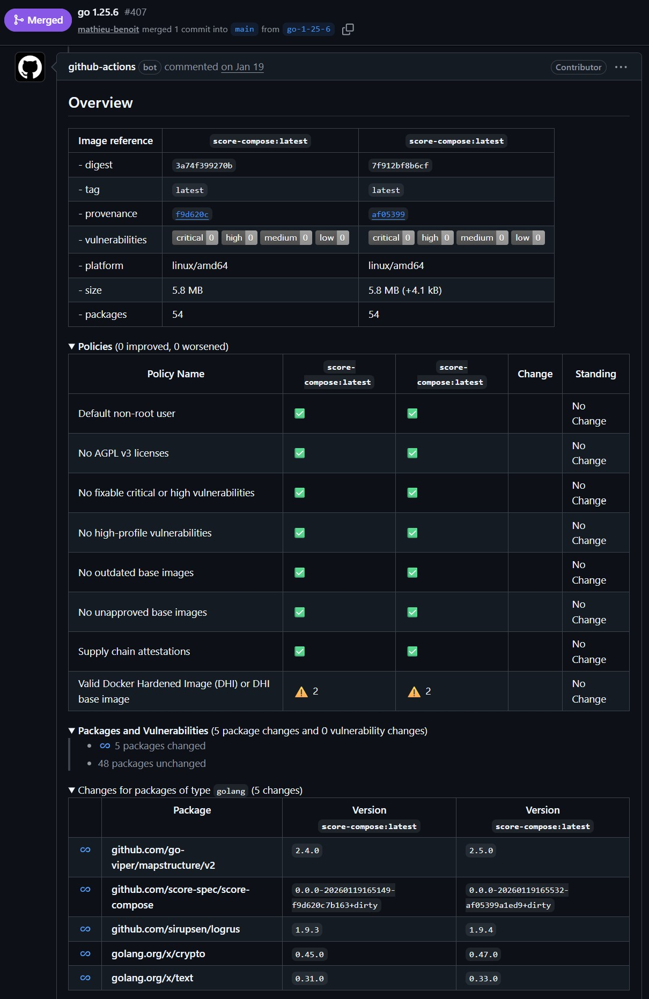
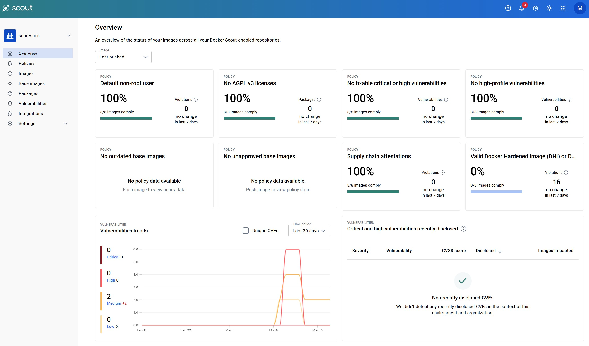
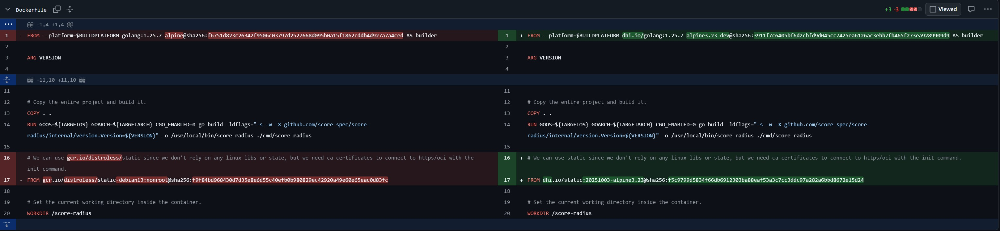
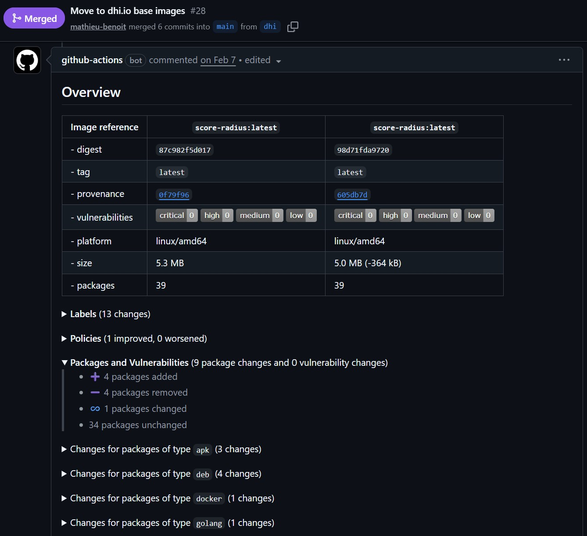
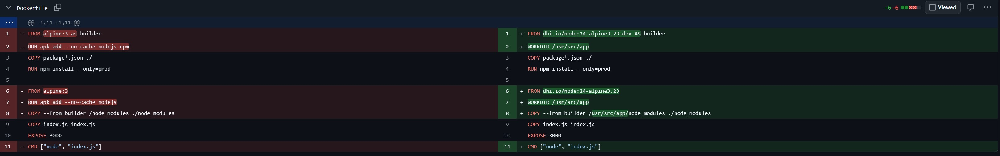
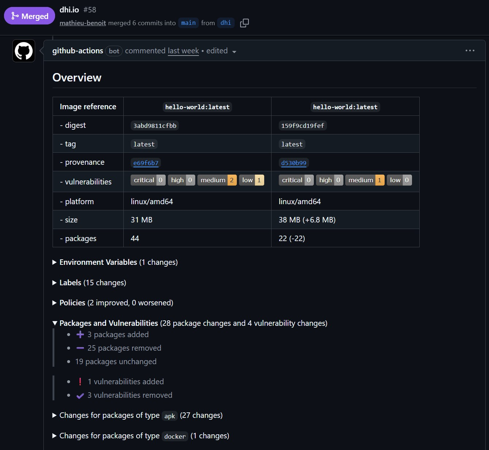

As CNCF Maintainers of the Score project (CNCF Sandbox), we recently embarked on a journey to strengthen our security posture by participating in the Docker Sponsored Open Source Program. This post shares our experience, learnings, and the tangible security improvements we achieved. Our goal is to inspire others to take advantages of these security best practices by default for their own open source projects, under the CNCF umbrella and not only.

## The Opportunity

In September 2025, [the CNCF announced a partnership with Docker](https://www.cncf.io/announcements/2025/09/18/cncf-expands-infrastructure-support-for-project-maintainers-through-partnership-with-docker/) to expand infrastructure support for project maintainers through the Docker Sponsored Open Source (DSOS) Program. This program offers CNCF projects access to Docker's security scanning tools, container registry, and best practices resources, at no cost.

This aligned perfectly with the discussions that happened during the [Maintainer Summit NA 2025 in Atlanta](https://contribute.cncf.io/blog/2025/11/08/maintainer-summit-update-from-the-project-staff): to collaborate more across CNCF projects and demonstrate security best practices.

The [Docker Sponsored Open Source (DSOS) Program](https://docs.docker.com/docker-hub/repos/manage/trusted-content/dsos-program/) provides several features and benefits to non-commercial open source developers.

The program grants the following perks to eligible projects:
- Repository logo
- Verified Docker-Sponsored Open Source badge
- Insights and analytics
- Access to Docker Scout for software supply chain management
- Removal of rate limiting for developers
- Improved discoverability on Docker Hub

## Docker Hub

**Before:** Score is publishing four containers: three for the CLIs of [`score-compose`](https://github.com/score-spec/score-compose), [`score-k8s`](https://github.com/score-spec/score-k8s) and [`score-radius`](https://github.com/score-spec/score-radius); and the [`sample-score-app`](https://github.com/score-spec/sample-score-app) for demos and testing. We used to publish them in GitHub Container Registry [here](https://github.com/orgs/score-spec/packages).

**After:** Being part of the DSOS Program gives use the opportunity to publish them in Docker Hub, and gain more visibility and trust from the community.

You can now find our four container images [in Docker Hub here](https://hub.docker.com/u/scorespec).

What's interesting from here is to get more insights about the actual usage by our community, here is an example of some insightful analytics we have access to now:

## Docker Scout

**Before:** Score as a CNCF project has been following the [OpenSSF best practices](https://www.bestpractices.dev/en). We also have the [OpenSSF Scorebard GitHub Action](https://securityscorecards.dev/) running continuously. That's a good start, but Score didn't have any security scanning tool in place before.

**After:** Being part of the DSOS Program gave us the opportunity to use Docker Scout in our Pull Requests and in our container registry (Docker Hub). This is a huge win for us, getting more insights about CVEs introduced or fixed by a specific Pull Request or a specific Release.

The following snippet shows how we use the `docker/scout-action` step for any Pull Request, by comparing the container image from the `main` branch and the current PR's branch:


- name: Docker Scout Comparison between main branch and current PR branch
  uses: docker/scout-action@v1
  with:
    command: compare
    image: local://score-compose:pr-${{ github.event.number }}
    to: local://score-compose:main
    write-comment: true
    github-token: ${{ secrets.GITHUB_TOKEN }}
    organization: ${{ secrets.DOCKER_HUB_ORG }}


Here is an example of the resulting comment of this `docker/scout-action` step:

We can have the details of the comparison between the two images (before versus after): size, packages updated, added or deleted, CVEs added and removed and also the compliance with our [policies defined at our Docker Organization](https://docs.docker.com/scout/policy/) (run as non-root, no critical CVEs, no packages with AGPL v3 licences).

And this is not just about the container images themselves, that's also about the Go librairies used and binaries published in these container images. So insightful!

Furthermore, in the Docker Scout admin console, we are also able to get an entire holistic view of the CVEs, the packages, the base images and the policies across all our container images. It has never been that easy to find who is using what and in which version!

## Docker Hardened Images

When [Docker made Hardened Images freely available under Apache 2.0](https://www.docker.com/press-release/docker-makes-hardened-images-free-open-and-transparent-for-everyone/), we saw an opportunity to simplify our security posture while maintaining compatibility with our existing `Dockerfiles` and workflows. Even if we were already doing multi-stage builds and were using `distroless` base images.

Docker Hardened Images are minimal, security-focused container base images designed to reduce inherited risk in downstream projects. They are built and maintained with security and transparency as defaults, featuring:
- Minimal attack surface: Only required components are included.
- Non-root execution: Images run as non-root by default.
- Supply Chain Security: Includes published SBOMs and SLSA Level 3 build provenance.
- Active Maintenance: Ongoing patching and rebuilds are performed as vulnerabilities are disclosed.
- Open Standards: All images are reproducible, open source, and licensed under Apache 2.0, making them compatible with CNCF governance and distribution models.

The migration was remarkably seamless.

For example for the `score-radius` CLI (using [dhi.io/golang](https://dhi.io/catalog/golang) and [dhi.io/static](https://dhi.io/catalog/static)), here are the updates needed on the `Dockerfile`:

In the associated PR [here](https://github.com/score-spec/score-radius/pull/28), we can see that 22 packages were removed (package manager and shell included) and that 2 CVEs were removed:

Another example with the `sample-score-app` (using [dhi.io/node](https://dhi.io/catalog/node)), here are the updates needed on the `Dockerfile`:

In the associated PR [here](https://github.com/score-spec/sample-score-app/pull/58), we can see that 0.3MB was saved for the size while keeping the same number of packages and still having 0 CVEs. We could have stayed with `debian` but we decided to move to an `alpine` base image (DHI provides the [two options](https://docs.docker.com/dhi/core-concepts/glibc-musl/)):

_Note: Proud moment, we were able to do a quick walkthrough about our DHI integration during the webinar organized by the CNCF on January 23rd, 2026 associated to [this DHI announcement for the CNCF projects](https://contribute.cncf.io/blog/2026/01/21/docker-hardened-images-for-cncf-projects)._

## docker/github-builder

Not directly related to the DSOS Program, but we took the opportunity to use the new [`docker/github-builder` GitHub reusable workflow](https://docs.docker.com/build/ci/github-actions/github-builder/) to release our container images.

> This model gives you a build pipeline that is maintained in the Docker organization, uses a pinned BuildKit environment, distributes multi-platform builds across runners when that helps, and emits signed SLSA provenance that records both the source commit and the builder identity.
> That tradeoff is intentional. You keep control of when the build runs and which inputs it uses, but the build implementation itself lives in the Docker-maintained workflow rather than in per-repository job steps.

**Before:** we were doing:


  release-container-image:
    runs-on: ubuntu-latest
    permissions:
      id-token: write
      packages: write
    steps:
      - name: Set up Docker Buildx
        uses: docker/setup-buildx-action@v3
      - name: Login to Docker Hub (docker.io)
        uses: docker/login-action@v3
        with:
          registry: docker.io
          username: ${{ secrets.DOCKER_HUB_USERNAME }}
          password: ${{ secrets.DOCKER_HUB_RELEASE_TOKEN }}
      - name: Login to GitHub Container Registry
        uses: docker/login-action@v3
        with:
          registry: ghcr.io
          username: ${{ github.actor }}
          password: ${{ secrets.GITHUB_TOKEN }}
      - name: Build and push docker image
        id: build-push-container
        uses: docker/build-push-action@v6
        with:
          context: .
          platforms: linux/amd64,linux/arm64
          push: true
          provenance: mode=max
          sbom: true
          tags: |
            ghcr.io/score-spec/score-compose:${{ github.ref_name }}
            ghcr.io/score-spec/score-compose:latest
            docker.io/scorespec/score-compose:${{ github.ref_name }}
            docker.io/scorespec/score-compose:latest
          build-args: |
            "VERSION=${{ github.ref_name }}"
      - name: Sign container image
        run: |
          cosign sign --yes ghcr.io/score-spec/score-compose@${{ steps.build-push-container.outputs.digest }}
          cosign sign --yes scorespec/score-compose@${{ steps.build-push-container.outputs.digest }}


**After:** that's what we are doing now:


  release-container-image:
    uses: docker/github-builder/.github/workflows/build.yml@v1
    permissions:
      id-token: write
      packages: write
    with:
      output: image
      push: true
      platforms: linux/amd64,linux/arm64
      sbom: true
      cache: true
      context: .
      set-meta-labels: true
      set-meta-annotations: true
      build-args: |
        "VERSION=${{ github.ref_name }}"
      meta-images: |
        ghcr.io/score-spec/score-compose
        scorespec/score-compose
      meta-tags: |
        type=ref,event=tag
        latest
    secrets:
      registry-auths: |
        - registry: ghcr.io
          username: ${{ github.actor }}
          password: ${{ secrets.GITHUB_TOKEN }}
        - username: ${{ secrets.DOCKER_HUB_USERNAME }}
          password: ${{ secrets.DOCKER_HUB_RELEASE_TOKEN }}


This workflow provides a trusted BuildKit instance and generates signed SLSA-compliant provenance attestations, guaranteeing the build happened from the source commit and all build steps ran in isolated sandboxed environments from immutable sources. This enables GitHub projects to follow a seamless path toward higher levels of security and trust.

We still get our container images signed by `cosign`. Anyone can verify the trusted signature like this:


cosign verify \
    --experimental-oci11 \
    --new-bundle-format \
    --certificate-oidc-issuer https://token.actions.githubusercontent.com \
    --certificate-identity-regexp ^https://github.com/docker/github-builder/.github/workflows/build.yml.*$ \
    ghcr.io/score-spec/score-compose@sha256:8dc5be472c7b71d55284451fd37d95710b10b742a6d06b79a34d70131eaaa4b4


## That's a wrap!

Being part of the Docker Sponsored Open Source (DSOS) Program has been so rewarding and has helped adopt a security by default foundation for the Score project. Using Docker Scout, Docker Hardened Images and the `docker/github-builder` has reinforced the security posture of our container images as well as demonstrated broader benefits for the Score projects and repositories.

If you maintain a CNCF project or any open source project, we highly encourage you to explore the Docker Sponsored Open Source (DSOS) Program. The security improvements we achieved were significant, and the process was straightforward.

You can check out our full implementation across the different Score repositories in this [GitHub issue #376](https://github.com/score-spec/score-compose/issues/376), which tracks all the work done.

Attending KubeCon EU 2026 in Amsterdam? Feel free to connect with us, [we'll be there too](https://score.dev/blog/score-at-kubecon-eu-2026-in-amsterdam/)!

_Note: While this work was completed after I personally joined Docker, this was an initiative we wanted to pursue as CNCF project Maintainers as soon as it was [announced back in September 2025](https://www.cncf.io/announcements/2025/09/18/cncf-expands-infrastructure-support-for-project-maintainers-through-partnership-with-docker/), to improve our security posture and share best practices and learnings with the broader community._

Hoping that you will be able to take inspiration of some tools and tips shared throughout this blog post for your own projects, cheers!
