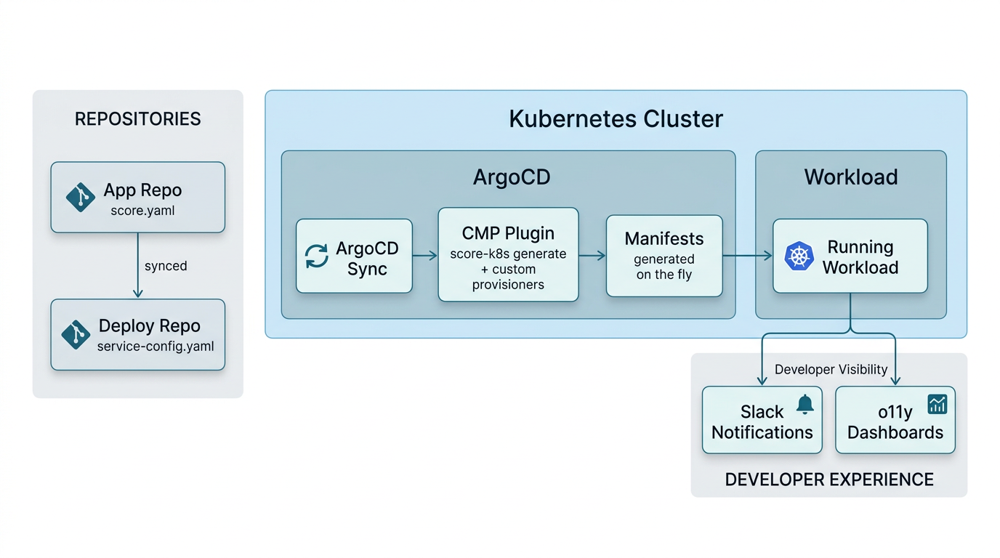

Recently, the Infrastructure team at Engine started a project that would change how every engineering team ships software. We were migrating dozens of services off a legacy container orchestration setup onto Kubernetes, and we had a choice to make: build another pile of bespoke tooling, or find an abstraction that could scale with us.

The real problem wasn't Kubernetes itself. It was everything around it. Deploying a new service took days, sometimes weeks, and almost none of that time was spent on application code. Developers were writing Terraform, learning container orchestration internals, and debugging cloud provider quirks before they could get anything running. Infrastructure config was scattered across repos. It was tightly coupled with application code. Every feature release and bug fix dragged because of it.

We wanted something different. Developers write code. They build a container image. The platform handles everything else: networking, secrets, autoscaling, monitoring, deployment strategy. Standardized, automated, and consistent across environments.

That's what brought us to [Score](https://score.dev).

## Finding the Right Abstraction

We looked at Helm charts, Kustomize overlays, custom templating engines, and a few workload specification tools. Most of them solved part of the problem but shifted complexity somewhere else, or locked us into patterns that would be painful to change later.

Score clicked because it matched the contract we wanted between developers and the platform. A developer writes a single `score.yaml` describing what their service needs. The platform decides how to deliver it. This is the [workload-centric model](https://score.dev/blog/workload-centric-over-infrastructure-centric-development) Score was designed around. This separation of concerns is fundamental to how Engine scales its platform.

The [provisioner system](https://docs.score.dev/docs/score-k8s/custom-provisioners/) sealed it. We could define how each resource type maps to our infrastructure without forking Score or maintaining a parallel abstraction layer. And because `score-k8s` generates manifests offline, with no cluster access or API calls, it dropped cleanly into our GitOps pipeline.

## What a Service Looks Like

Here's a simplified `score.yaml` for one of our services:


apiVersion: score.dev/v1b1

metadata:
  name: my-service
  engineNamespace: payments
  level1System: checkout
  level2System: my-service
  repoSlug: MyOrg/my-service
  identity: default

containers:
  web:
    image: "."
    resources:
      requests:
        memory: 512Mi
        cpu: 200m
      limits:
        memory: 512Mi
    livenessProbe:
      httpGet:
        path: /healthz
        port: 3000
    readinessProbe:
      httpGet:
        path: /status
        port: 3000

service:
  ports:
    http:
      port: 3000

resources:

  deployment:
    type: blue-green

  config:
    type: configmap
    params:
      configData:
        APP_NAME: "my-service"
        NODE_ENV: "production"
        AWS_REGION: ${metadata.region}
        LOG_LEVEL: "info"

  app-secrets:
    type: cloud-secret
    params:
      name: my-service-secrets

  pod-identity:
    type: pod-identity

  networking:
    type: basic
    params:
      ingress:
        type: public
        aliases:
          - my-service
        privateRoutes: ["/healthz", "/status"]
      egress:
        allowAll: true

  autoscaling:
    type: horizontal-pod-autoscaler
    params:
      minReplicas: 2
      maxReplicas: 10
      scalingMetric: cpu
      scalingMetricThreshold: 80

  monitoring:
    type: monitoring
    params:
      devTeamSlackChannel: "my-team-alerts"


That file generates over 25 Kubernetes resources: a namespace, an Argo Rollout with blue-green strategy, service mesh networking (gateway, virtual service, destination rule, network policy), pod identity, a config map, secrets via External Secrets Operator, HPA, PDB, and monitoring resources. The developer doesn't write or maintain any of that. They describe what they need; the platform figures out the rest.

## Building the Platform Layer

Generation runs inside an [ArgoCD Config Management Plugin](https://argo-cd.readthedocs.io/en/stable/operator-manual/config-management-plugins/). When ArgoCD syncs, the plugin calls [score-k8s generate](https://docs.score.dev/docs/score-k8s/) with our [custom provisioners](https://docs.score.dev/docs/score-k8s/custom-provisioners/) and patches, then passes the output back for deployment. Same Score file plus same provisioner version, same manifests. No surprises.

We've built about 13 provisioners at this point, covering the full lifecycle:

- **blue-green**: Namespace, ServiceAccount, Argo Rollout, Services
- **basic (networking)**: Service mesh gateway, virtual service, destination rule, network policy
- **pod-identity**: Cloud IAM roles and pod identity associations
- **cloud-secret**: External Secrets backed by a cloud secrets manager
- **horizontal-pod-autoscaler**: HPA with configurable scaling metrics
- **monitoring**: Monitoring resources with alert routing
- **pre-deployment-job**: Jobs that run before deployment (like database migrations)

Each provisioner uses workload metadata to derive naming, namespace conventions, and configuration. We actually hit a limitation early on where provisioner templates couldn't access workload-level metadata, only resource-level fields. Rather than coupling every Score file to our internal naming schemes through explicit parameters, we [contributed a fix upstream](https://github.com/score-spec/score-k8s/pull/232). That collaboration with the Score maintainers was fast and constructive, which gave us confidence we'd picked the right project to build on.

## The Repo Flow

A question that comes up often with Score-based platforms is how the repos are structured. We use two:

The **app repo** is where the service code lives, along with the `score.yaml` file. Developers own this. When they need to change resource requests, add a secret, or adjust autoscaling, they edit `score.yaml` and open a PR in their own repo.

The **deploy repo** is where ArgoCD watches for changes. It contains a `service-config.yaml` per service that pins the provisioner library version and container image tags for each environment. A promotion tool updates image tags here when a new build is ready.

The Score file from the app repo gets synced into the deploy repo. When ArgoCD detects a change, the CMP plugin runs `score-k8s generate` with the provisioners and produces manifests on the fly. Those manifests are never stored in git; they exist only during the sync. We explored using ArgoCD's source hydrator to persist the generated manifests back to git, but hit an [open issue](https://github.com/argoproj/argo-cd/issues/22719) with the multi-repo setup we needed, so we generate them on the fly via the CMP instead.

For developers, the ArgoCD UI isn't part of their workflow today. They get deployment status through Slack notifications and PR comments (especially useful for preview environments), and operational visibility through observability dashboards. We're standing up a developer portal that will eventually provide a unified view, but for now Slack and dashboards cover the core needs.

## How It All Fits Together

One of our core principles is that platform infrastructure isn't a snapshot. It gets maintained and upgraded as the platform evolves. Score's model makes this practical.

We version our provisioner library separately from services. Dev environments run the latest version. Production pins to a stable tag. When we improve how networking or monitoring resources are generated, every service picks up the change on its next deploy without anyone touching a Score file.

This also means the Score spec acts as a clean boundary. Developers own their `score.yaml`. The platform team owns the provisioners. Neither side needs to understand the other's internals. When we change a naming convention or restructure how namespaces work, it's a provisioner update, not a multi-repo migration.

## What We Learned

**Start with a real service.** We onboarded one service end to end before writing a second provisioner. That first pass exposed assumptions about networking, secrets, and deployment ordering that would've been painful to discover later. If you're building a Score-based platform, get something real running before you try to generalize.

**Keep generation offline.** Our provisioners never call external APIs. If a resource needs runtime information (a dynamically assigned hostname, for example), Kubernetes operators handle it after deployment. Generation stays fast, deterministic, and easy to test locally.

**Invest in schema validation.** We publish a JSON Schema for our extended Score spec so developers get autocompletion and validation in their IDE as they write `score.yaml`. It catches mistakes before they reach the pipeline and cuts down on back-and-forth between teams.

**Contribute upstream when you can.** When we hit limitations, we could've patched around them internally. Contributing back took more effort up front but produced cleaner results and kept us from drifting away from the mainline project. The Score maintainers were responsive, which made it easy.

## Where We Are Now

We're actively onboarding more services to the platform and expanding our provisioner library for new patterns like shared dependencies and cross-service communication. What used to take days of infrastructure work now takes a developer a few minutes to define in a Score file.

Score gave us the abstraction we needed without taking away control. The provisioner system was flexible enough to encode our platform's opinions, and open enough that we could contribute back when something was missing. For any platform team looking at this space, it's worth a serious look.

*[Engine](https://www.engine.com) is a travel management platform used by over 20,000 businesses. This platform was built by Engine's Infrastructure team. Interested in working on problems like this? Check out our [open positions](https://www.engine.com/careers). Thanks to the Score maintainers for their collaboration and for the invitation to share our experience.*

- Get started with [score-k8s](https://github.com/score-spec/score-k8s)
- Learn about [custom provisioners](https://docs.score.dev/docs/score-k8s/custom-provisioners/)
- Join the conversation in #score on [CNCF Slack](https://communityinviter.com/apps/cloud-native/cncf)
