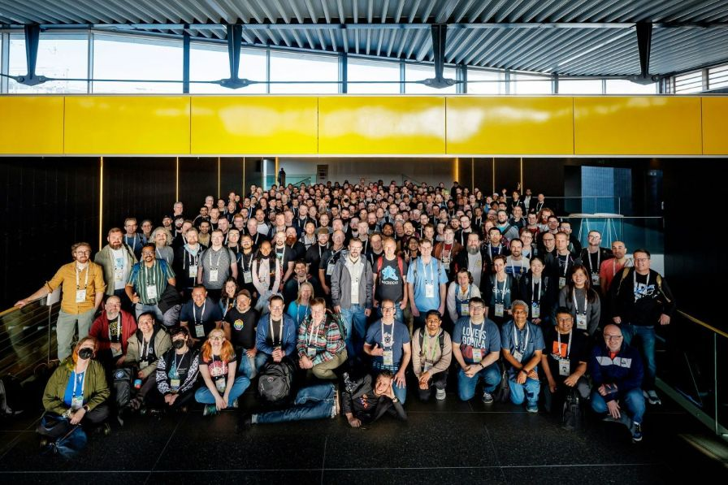
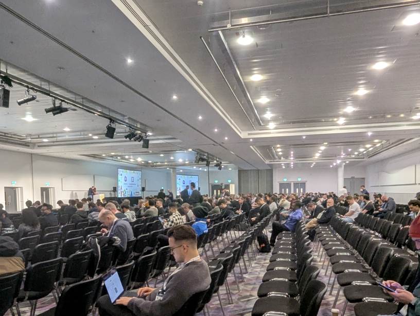
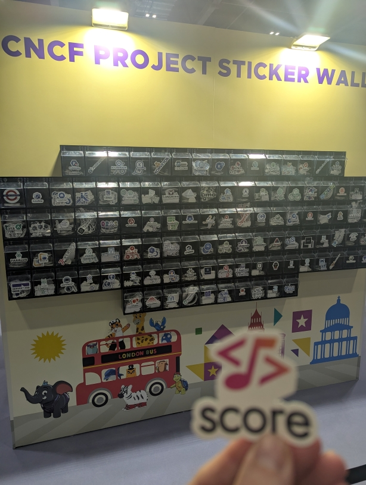
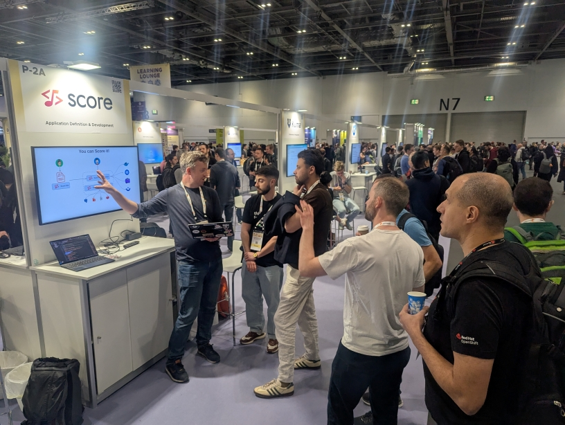
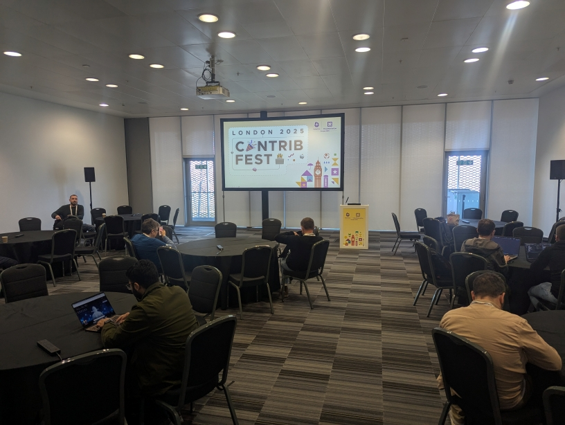

That's a wrap! [KubeCon EU 2025 in London](https://score.dev/blog/score-at-kubecon-eu-in-london/) was a blast. The Score project and its maintainers got a lot of opportunities to connect and collaborate with the community.

We are so grateful for these opportunities and for what the CNCF does to help individuals and projects to connect and grow.

Within its [first year as CNCF Sandbox project](https://score.dev/blog/score-joins-the-cncf-as-a-sandbox-project/), the sub-projects updates and the community achievements mark an exciting milestone for Score. We were so eager to connect with the CNCF community to showcase how Score is evolving.

This blog post is my trip report highlighting key activities related to the Score project that I have captured during this KubeCon 2025 in London.

On Sunday, I attended the [Cloud Native Rejekts](https://cloud-native.rejekts.io/) (highly recommended!). A great place to connect with ~250 people, right before KubeCon, a good warm up. There, I met with [Stevan from Red Hat](https://www.linkedin.com/in/stevanlemeur/) and [Yacine from Postman](https://www.linkedin.com/in/yacinekheddache/) to respectively chat about how we could better illustrate how Score could be used with [Podman](https://podman.io/) and [Microcks](https://microcks.io/). Stay tuned!

As Score Maintainer, I was able to attend the [Maintainer Summit](https://events.linuxfoundation.org/kubecon-cloudnativecon-europe/features-add-ons/maintainer-summit/) on Monday, opened not just for Kubernetes maintainers for the first time. Got so much inspirations to make the Score project and its community growing.

As Score Maintainer, I was delighted to represent the Score project and its community on Tuesday by delivering a [Project Lightning talk](https://sched.co/1tcwp) to 300+ people:

As Sandbox project, the CNCF printed the Score logo as a sticker that was available in the CNCF projects stickers wall:

With [Nils from Humanitec](https://www.linkedin.com/in/nilsty/), we delivered a workshop on Tuesday to 50 people to talk about Score and the Humanitec's Score implementation:

With [Kendall from Diagrid](https://www.linkedin.com/in/kendallroden/), we delivered a [talk about Dapr and Score](https://sched.co/1txGi) on Wednesday to ~800 people in the room:

As Sandbox project, the CNCF gave Score the opportunity to have a Kiosk in the Project Pavilion area, on Thursday for 3 hours. [Ben](https://www.linkedin.com/in/ben-meier-b76224129/), [Chris](https://www.linkedin.com/in/chris-stephenson-99ba3628/) and I as Score Maintainers were able to discuss with ~30 people:

As Sandbox project, the CNCF gave Score the opportunity to have a [ContribFest](https://sched.co/1tczO), on Thursday for 1.5 hours. [Ben](https://www.linkedin.com/in/ben-meier-b76224129/), [Chris](https://www.linkedin.com/in/chris-stephenson-99ba3628/) and I as Score Maintainers were able to help ~20 people make their first contributions to a CNCF project while improving the Score project. I had also a great discussion with [Stéphane from ITQ](https://www.linkedin.com/in/sestegra/) to see how projects could be more inclusive, and how we could simplify the onboarding process of new contributors.

With [Maxime from RBC](https://www.linkedin.com/in/maximecoquerel/), we delivered a talk about [Platform Engineering and Security](https://sched.co/1txGE) on Thursday to ~800 people in the room:

That's a wrap!

Mind-blowing!

So grateful and thankful for these opportunities, collaborations and the discussions generated. This is so inspiring!

For those looking to dive deeper into Score, our CNCF Slack channel and our monthly Community Calls offer a collaborative space to explore the latest updates, discuss challenges, and connect with other users. Stay informed by [visiting our community page](https://docs.score.dev/docs/community/) and signing up for the calls.

Now, back to prepare and cook what will be next for [KubeCon NA 2025 in Atlanta](https://events.linuxfoundation.org/kubecon-cloudnativecon-north-america/)! ;)