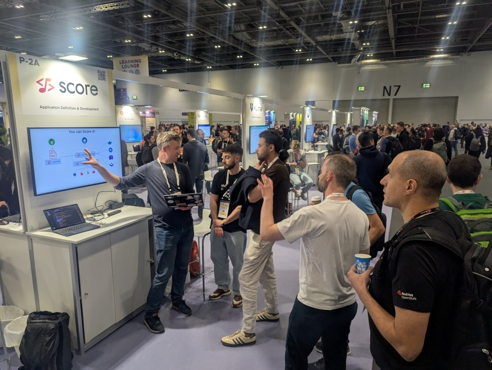

After three KubeCons: [in Salt Lake City in 2024](https://score.dev/blog/score-at-kubecon-na-in-slc/), [in London in 2025](https://score.dev/blog/kubecon-london-2025-trip-report/) and most recently [in Atlanta in 2025](https://score.dev/blog/kubecon-london-2025-trip-report/), Score will be very well represented in Amsterdam for its fourth KubeCon as CNCF Sandbox project.

This year's updates and community achievements mark another exciting milestone, and we're eager to connect with the cloud-native community to showcase how Score is evolving.

Here are three opportunities to hear more about Score and meet with its maintainers at this year's KubeCon EU in Amsterdam in March 2026.

## Opportunity #1 - Maintainer Summit

**Sunday March 22nd, 2026**

To represent the Score project as CNCF Project Maintainer, Mathieu has been accepted to attend the [Maintainer Summit](https://events.linuxfoundation.org/kubecon-cloudnativecon-europe/features-add-ons/maintainer-summit/), for the third time in a row.

The CNCF Maintainer Summit is an exclusive event for the people behind the CNCF projects to gather face-to-face, collaborate, and celebrate the projects that make "Cloud Native". Programming will be focused on sharing best practices, diving into contributing processes, and solving common problems across projects to enrich our great community of maintainers.

## Opportunity #2 - Talk: Score + Microcks

[Unifying Inner & Outer Loops To Bridge the Gaps Between Devs & Ops With Microcks + Score - Laurent Broudoux, Microcks & Mathieu Benoit, Docker](https://sched.co/2CVxb).

**Tuesday March 24th, 2026 11:15-11:45am** at [KubeCon](https://events.linuxfoundation.org/kubecon-cloudnativecon-europe/program/schedule/)

Tired of "it works on my machine" moments? This session shows how to bridge the inner and outer development loops using Microcks and Score. We'll start locally, where Score generates docker-compose files and Microcks provides realistic mocks for fast, contract-driven dev. Then we'll scale up, using the same Score specs to create Kubernetes manifests, keeping environments in sync. Need to simulate missing or external 3rd-party services? Microcks handles that too in any environment. See how this setup reduces friction, catches integration issues early, and saves time. Bonus: a live demo with a real-world use case (Finos/TraderX). If you're building cloud native apps, don't miss this!

A great collaboration with [Yacine](https://www.linkedin.com/in/yacinekheddache/) and [Laurent](https://www.linkedin.com/in/laurentbroudoux/) from the [Microcks project](https://www.cncf.io/projects/microcks/)! In the meantime, you can see this "better together" story already in actions in this blog post: [Unifying the Inner & Outer Loops to Bridge the Gaps between Devs & Ops with Containers + Microcks + Score](https://itnext.io/unifying-inner-outer-loops-to-bridge-the-gaps-between-devs-ops-with-containers-microcks-d28603342f4b).

## Opportunity #3 - Project Kiosk P-3A

**Thursday March 26th, 2026 - 10am-2pm**

Score will have a dedicated **Kiosk P-3A** provided by the CNCF (thank you!) in the [Project Pavilion](https://events.linuxfoundation.org/kubecon-cloudnativecon-europe/features-add-ons/project-engagement/#project-pavilion) on Thursday between 10am and 2pm. Please visit this Kiosk to meet with Score Maintainers. We will answer all your questions and will show live demos.

## Project updates

The Score project got some updates in the last few months. Here are the most notable ones since last KubeCon NA 2025:
- [`score-compose`](https://docs.score.dev/docs/score-implementation/score-compose/), since its version [`0.30.0`](https://github.com/score-spec/score-compose/releases/tag/0.30.0) natively supports the Docker Model Runner feature of Docker Compose. This simplifies how workloads can interact with local LLM models. See it in actions in this blog post: [Score + Docker Compose to deploy your local LLM models](https://medium.com/google-cloud/score-docker-compose-to-deploy-your-local-llm-models-10aff89686ce). Thanks [Ummam, for your contribution](https://github.com/score-spec/score-compose/pull/392)!
- [`score-k8s`](https://docs.score.dev/docs/score-implementation/score-k8s/), since its version [`0.8.2`](https://github.com/score-spec/score-k8s/releases/tag/0.8.2) allows the access of the workload's `metadata` in the [`score-k8s`'s provisioners](https://docs.score.dev/docs/score-implementation/score-k8s/resources-provisioners/). Thanks [Jared, for your contribution](https://github.com/score-spec/score-k8s/pull/232)!
- [`score-radius`](https://github.com/score-spec/score-radius) went out as a new experimental Score implementation (we want your feedback!). We got the opportunity to do a [live demo during the Radius Community Meeting on December 9th 2025](https://youtu.be/XJorwBWmWCI?list=PLrZ6kld_pvgwYMLI-j_f0Dq2Dgv5MlK8R&t=1753). You can see it in actions also here in this blog post: [CNCF Sandbox projects: Score & Radius, a better together story, from a Workload spec to Kubernetes](https://itnext.io/cncf-sandbox-projects-score-radius-a-better-together-story-from-a-workload-spec-to-kubernetes-73a5708728c6).
- We are also now taking advantage of the [Docker's Sponsored Open Source Program from the CNCF-Docker partnership](https://contribute.cncf.io/blog/2026/01/15/docker-sponsored-open-source-program). We will share our learnings, tips and the associated benefits in a dedicated blog post soon, stay tuned! In the meantime, you can learn more about what we have done [here](https://github.com/score-spec/score-compose/issues/376).
- Score @ KubeCon India 2026: [Abhinav Sharma](https://www.linkedin.com/in/abhinavsharma0/) & [Mumshad Mannambeth](https://www.linkedin.com/in/mmumshad/) from KodeKloud got their talk [The Death of the YAML-Engineer: Engineering "Invisible" Platforms With Crossplane and Score](https://sched.co/2IW4r) accepted.

Interested in knowing more about Score or even contributing to Score? [Visit our community page](https://docs.score.dev/docs/community/) to connect with Score users, contributors and maintainers there!

Can't wait to attend [KubeCon Amsterdam](https://events.linuxfoundation.org/kubecon-cloudnativecon-europe/) and see where this edition will bring the Score project!

See you there!?
