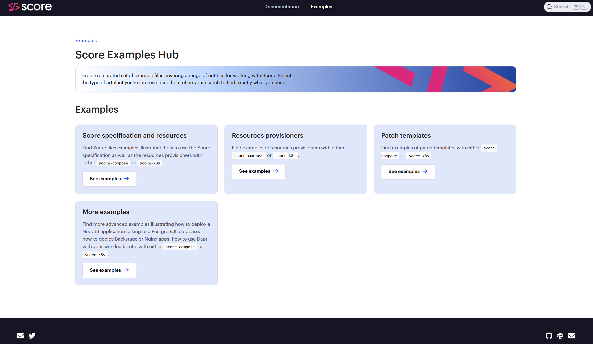

After [KubeCon NA in Salt Lake City in 2024](https://score.dev/blog/score-at-kubecon-na-in-slc/) and [KubeCon EU in London in 2025](https://score.dev/blog/kubecon-london-2025-trip-report/), Score will be very well represented for its third KubeCon as CNCF Sandbox project in Atlanta.

This year’s updates and community achievements mark another exciting milestone, and we’re eager to connect with the cloud-native community to showcase how Score is evolving.

Here are three opportunities to hear more about Score and meet with maintainers and contributors at this year’s KubeCon NA in Atlanta in November 2025.

## Opportunity #1 - Talk: Score + Kro at Cloud Native Rejekts

[Make your Developer's Pains go Away, with the Right Level of Abstraction for your Platform](https://cfp.cloud-native.rejekts.io/cloud-native-rejekts-atlanta-na-atlanta-2025/talk/X3LUL3/).

**Saturday November 8th, 2025 11:45am–12:15pm.** at [Cloud Native Rejekts](https://cloud-native.rejekts.io/)

Developers don’t code eight hours a day. They code one — and fight with TicketOps, Infrastructure dependencies and Security blockers the rest of the time. Many platform teams build Internal Developer Platforms (IDPs) to help, but poor abstraction choices make things worse. In this talk, we’ll share a battle-tested approach to building the right level of abstraction on top of Kubernetes using Score and Kro.

You’ll learn how to go beyond templating, reduce cognitive load, and deliver a developer experience that people actually want to use. We’ll demo how developers can deploy secure, production-grade workloads by just focusing on their applications to bring value to their end users — while the platform handles the hard parts behind the scenes.

This talk isn’t about Kubernetes and GitOps. It’s about empathy. It’s about platforms people adopt, not abandon.

## Opportunity #2 - Maintainer Summit

**Sunday November 9th, 2025**

To represent the Score project, Mathieu got the invitation to attend the [Maintainer Summit](https://events.linuxfoundation.org/kubecon-cloudnativecon-north-america/features-add-ons/maintainer-summit/), for the second time in a row.

The CNCF Maintainer Summit is an exclusive event for the people behind the CNCF projects to gather face-to-face, collaborate, and celebrate the projects that make “Cloud Native.” Programming will be focused on sharing best practices, diving into contributing processes, and solving common problems across projects to enrich our great community of maintainers.

## Opportunity #3 - Kiosk 10A: Meet Score Maintainers

**Wednesday November 12th, 2025 - 2-5pm**

Score will have a dedicated **Kiosk 10A** provided by the CNCF (thank you!) in the [Project Pavilion](https://events.linuxfoundation.org/kubecon-cloudnativecon-north-america/features-add-ons/project-engagement/#project-pavilion) on Wednesday afternoon. Please visit this Kiosk to meet with Score Maintainers. We will answer all your questions and will show live demos.

## Projects updates

Score projects got some updates in the last few months, since last KubeCon EU 2025:
- [Last July, Score just turned 1 as CNCF Sandbox project!](https://score.dev/blog/celebrating-1-year-as-cncf-sandbox/)
- [`spec`](https://github.com/score-spec/spec/releases) got a new update: `files` and `volumes` as `maps` instead of `arrays`.
- [`score-compose`](https://github.com/score-spec/score-compose/releases), in addition to some bugs fixed and the integration of the new `spec` version, got the new `score-compose provisioners list` supporting `cmd` provisioners and got a new `postgres-instance` provisioner in the [default provisioners]().
- [`score-k8s`](https://github.com/score-spec/score-k8s/releases), in addition to some bugs fixed and the integration of the new `spec` version, go the support of `Namespace` with `score-k8s generate [--namespace] [--create-namespace]` and a new custom `substituteValue` `sprig` function that can be used in the [patch templates]().
- Last but not least, the [new Score Examples Hub](https://score.dev/blog/score-examples-hub-announcement/) is out in the Score docs!

## Community highlights

Here are some examples of what the community has been sharing recently:

- [Unifying the Inner & Outer Loops to Bridge the Gaps between Devs & Ops with Containers + Microcks + Score](https://itnext.io/unifying-inner-outer-loops-to-bridge-the-gaps-between-devs-ops-with-containers-microcks-d28603342f4b)
- [Generate your Backstage software catalog files with Score](https://medium.com/@mabenoit/generate-your-backstage-software-catalog-files-with-score-b62aa33e8ecc)
- [LF Live Webinar: From CI to Kubernetes Catalog: A Practical Guide to vCluster and GitOps](https://youtu.be/U4AgmEo3oV8)
- [Deploying Angular Apps with Score: Platform-Agnostic Workflows for Docker, Podman & Kubernetes](https://blog.cloudikeme.com/posts/deploy-angular-apps-with-score-to-docker-kubernetes/)
- [Deploy WordPress with MySQL via Score](https://blog.cloudikeme.com/posts/deploy-wordpress-to-docker-with-score-compose/)
- [Deploy Backstage with Score](https://medium.com/@mabenoit/deploy-backstage-with-score-45bb2d7c2d90)
- [Stop Building Platforms Nobody Uses: Pick the Right Kubernetes Abstraction with GitOps](https://itnext.io/stop-building-platforms-nobody-uses-pick-the-right-kubernetes-abstraction-with-gitops-64681357690f)
- [From CI to Kubernetes Catalog: Building a Composable Platform with GitOps and vCluster](https://itnext.io/from-ci-to-kubernetes-catalog-building-a-composable-platform-with-gitops-and-vcluster-7e1decaa81da)

Interested in knowing more or even contributing to Score? [Visit our community page](https://docs.score.dev/docs/community/) to connect with Score users. contributors and maintainers there!

Can't wait to attend KubeCon Atlanta and see where this edition will bring the Score project!

See you there!?
