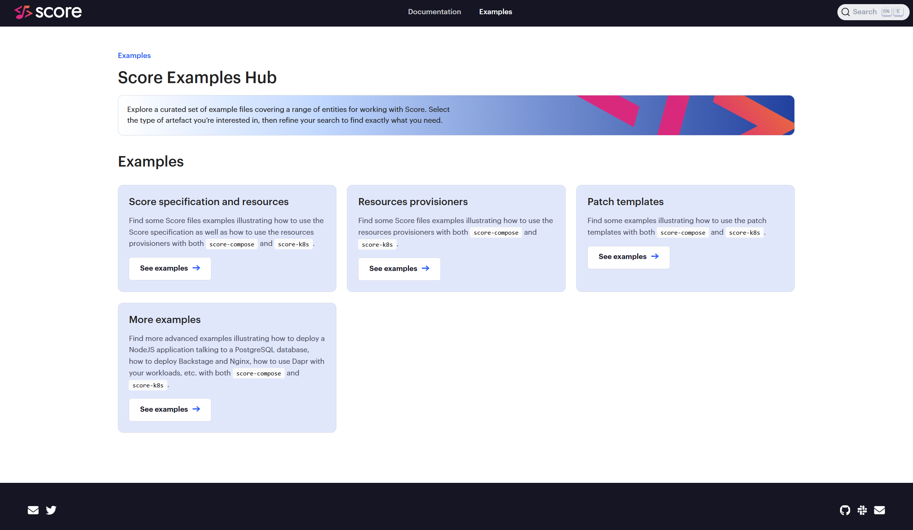
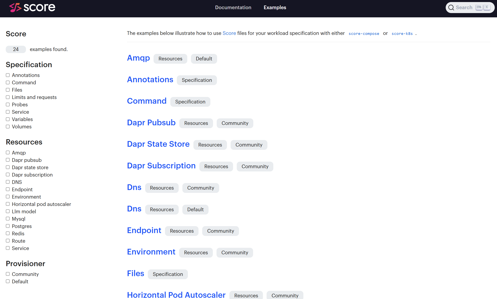
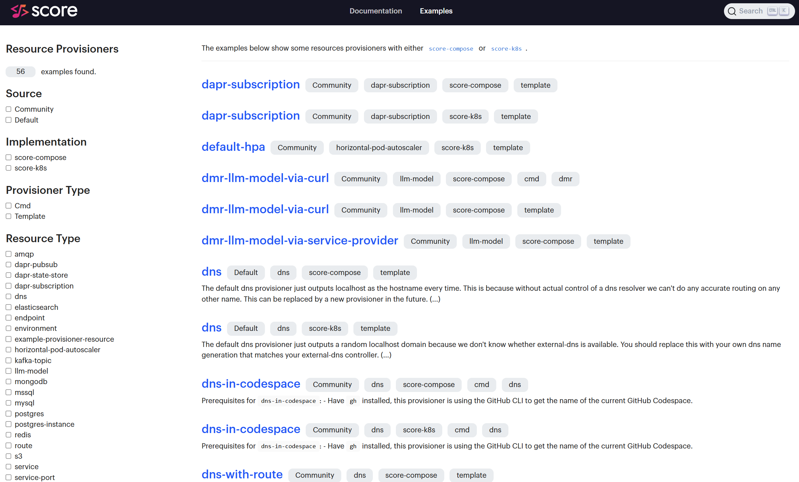
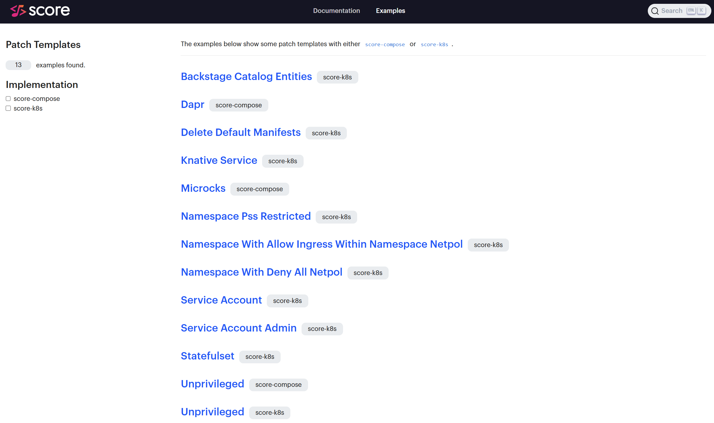
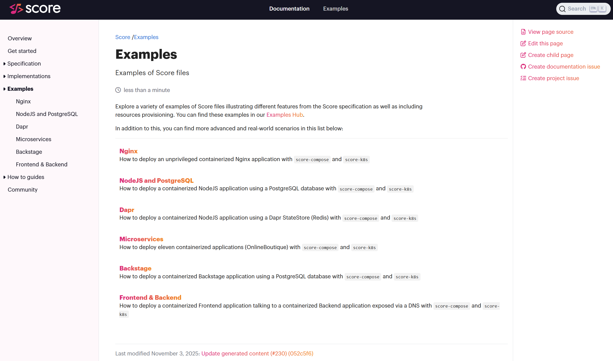

_Hi, there! Tobi here, Tech Writer for Humanitec and Score contributor._

🎉 Today, Score is officially announcing the new [Score Examples Hub](https://docs.score.dev/examples/)! 🎉

One of the feedback we have been capturing is to show more concrete examples and use cases of Score.

When we celebrated the first anniversary of Score couple of months ago, we provided a sneak peek about this Score Examples Hub. Since then, we we have been adding more examples of Score files, resources provisioners and patch templates.



## Score specification and resources examples

Find Score files examples illustrating how to use the Score specification as well as how to use the resources provisioners with both `score-compose` and `score-k8s`:



As an example, that's how in there you will be able to find how you can [use a local LLM model with Score and `score-compose`](https://docs.score.dev/examples/score/resources/community-provisioners/llm-model/):

`score.yaml`:
```yaml
apiVersion: score.dev/v1b1
metadata:
  name: my-workload
containers:
  my-container:
    image: busybox
    command: ["/bin/sh"]
    args: ["-c", "while true; do echo $LLM_BASE_URL; sleep 5; done"]
    variables:
      LLM_MODEL_NAME: "${resources.model.model}"
      LLM_BASE_URL: "${resources.model.url}"
resources:
  model:
    type: llm-model
    params:
      model: ai/smollm2:135M-Q4_0
```

Run:
```bash
score-commpose init \
    --provisioners https://raw.githubusercontent.com/score-spec/community-provisioners/refs/heads/main/llm-model/score-compose/10-dmr-llm-model-via-service-provider.provisioners.yaml

score-commpose generate score.yaml

docker compose up -d --wait
```

## Score resources provisioners examples

Find examples of resources provisioners for both `score-compose` and `score-k8s`:



## Score patch templates examples

Find examples of patch templates for both `score-compose` and `score-k8s`:



## More complete examples

Find more advanced examples illustrating how to deploy a NodeJS application talking to a PostgreSQL database, how to deploy Backstage and Nginx, how to use Dapr with your workloads, etc. with both `score-compose` and `score-k8s`:



## Kudos!

Huge kudos to [**Santiago Beroch**](https://www.linkedin.com/in/santiagoberoch/) for collaborating with me to design and implement this very powerful [Score Examples Hub](https://docs.score.dev/examples/)! And thanks, [Humanitec](https://humanitec.com/) for your support on this!

## What's next?

Please share your feedback with us and please do let us know if there is anything in particular you would like to see in this growing list of examples!
- [Join the #score channel in the CNCF Slack](https://cloud-native.slack.com/archives/C07DN0D1UCW)
- [Get started with Score](https://docs.score.dev/docs/get-started/)
- [Contribute to Score](https://clotributor.dev/search?foundation=cncf&project=score)

See you in Atlanta for [KubeCon NA 2025](https://events.linuxfoundation.org/kubecon-cloudnativecon-north-america/)!?
